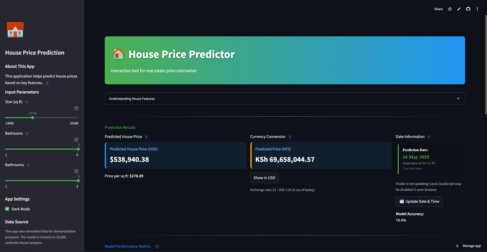

# House Price Prediction App

[](https://www.python.org/)
[](https://streamlit.io)
[](https://scikit-learn.org/)
[](https://www.docker.com/)

A production-ready web application for predicting house prices based on key features such as square footage, number of bedrooms, and bathrooms. This application uses machine learning (Linear Regression) to provide accurate price estimates and visualizes data in an interactive 3D plot.


*The House Price Prediction App interface showing the interactive sliders and prediction results. Users can adjust house parameters using sliders in the sidebar and see real-time price predictions in USD with an option to convert to Kenyan Shillings.*

## 📋 Features

- **Real-time Price Prediction**: Adjust house parameters and see price estimates instantly
- **Interactive 3D Visualization**: Explore the relationship between house features and prices
- **Feature Importance Analysis**: Understand which features most affect house prices
- **Machine Learning Model**: Utilizes scikit-learn's Linear Regression algorithm
- **User-friendly Interface**: Clean, intuitive UI built with Streamlit

## 🚀 Quick Start

### Prerequisites

- Python 3.7+
- Docker (optional)

### Installation Options

#### Option 1: Local Installation

1. **Clone this repository**

   ```bash
   git clone https://github.com/CollinsNyatundo/house-price-prediction.git
   cd house-price-prediction
   ```

2. **Set up virtual environment**

   ```bash
   python -m venv venv
   ```

3. **Activate virtual environment**
   - Windows:

     ```bash
     venv\Scripts\activate
     ```

   - macOS/Linux:

     ```bash
     source venv/bin/activate
     ```

4. **Install dependencies**

   ```bash
   pip install -r requirements.txt
   ```

5. **Run the application**

   ```bash
   streamlit run app.py
   ```

   Alternatively, use the included batch file (Windows):

   ```bash
   setup_and_run.bat
   ```

#### Option 2: Using Docker

1. **Clone this repository**

   ```bash
   git clone https://github.com/CollinsNyatundo/house-price-prediction.git
   cd house-price-prediction
   ```

2. **Build and run with Docker Compose**

   ```bash
   docker-compose up
   ```

   Or build and run with Docker directly:

   ```bash
   docker build -t house-price-prediction .
   docker run -p 8501:8501 house-price-prediction
   ```

3. **Access the app** in your browser at:
   - Local URL: <http://localhost:8501>
   - Network URL: (as displayed in terminal)

## 📁 Project Structure

```text
house-price-prediction/
├── src/                    # Source code package
│   ├── config/             # Configuration settings
│   ├── data/               # Data generation and processing
│   ├── models/             # ML model implementation
│   ├── utils/              # Utility functions and helpers
│   └── visualization/      # Data visualization components
├── tests/                  # Test suite
├── images/                 # Application screenshots and images
├── app.py                  # Main Streamlit application
├── Dockerfile              # Docker configuration
├── docker-compose.yml      # Docker Compose configuration
├── requirements.txt        # Python dependencies
├── setup.py                # Package installation script
├── Makefile                # Development workflow commands
└── README.md               # Project documentation
```

## 🛠️ Development

### Running Tests

```bash
pytest tests/
```

Or with coverage report:

```bash
pytest --cov=src tests/
```

### Code Formatting and Linting

Format code with Black and isort:

```bash
make format
```

Run linting checks:

```bash
make lint
```

### Common Tasks

The project includes a Makefile for common development tasks:

```bash
make help           # Show available commands
make clean          # Clean build artifacts
make test           # Run tests
make coverage       # Run tests with coverage
make docker-build   # Build Docker image
make docker-run     # Run Docker container
```

## 🔍 How It Works

The app uses a Linear Regression model trained on simulated house data. The model learns the relationship between house features (size, bedrooms, bathrooms) and prices, then makes predictions for new data points.

The 3D visualization allows you to see where your specific house configuration fits within the overall market landscape, with your current selection highlighted in red.

## 🤝 Contributing

Contributions are welcome! Please feel free to submit a Pull Request.

1. Fork the repository
2. Create your feature branch (`git checkout -b feature/amazing-feature`)
3. Format your code (`make format`)
4. Ensure tests pass (`make test`)
5. Commit your changes (`git commit -m 'Add some amazing feature'`)
6. Push to the branch (`git push origin feature/amazing-feature`)
7. Open a Pull Request


## 📬 Contact

For questions or feedback about this application, please open an issue in the repository.
